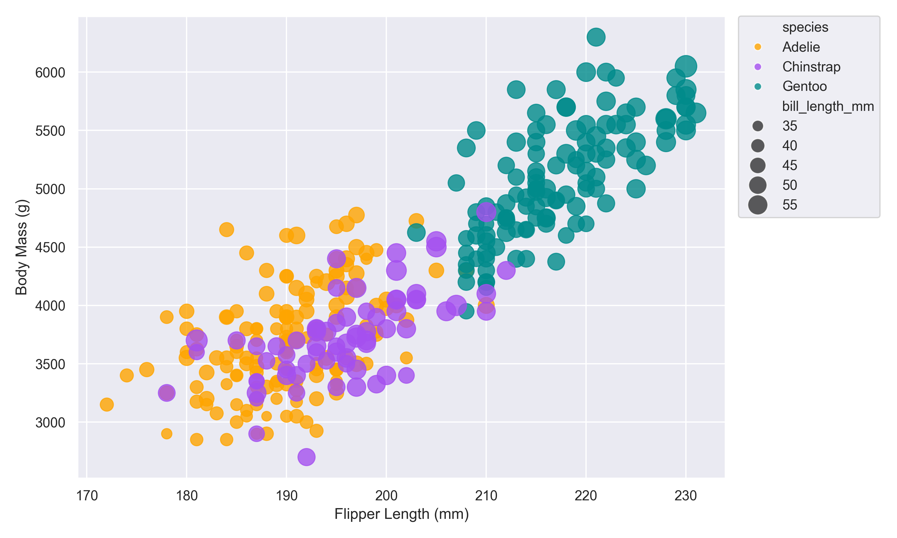
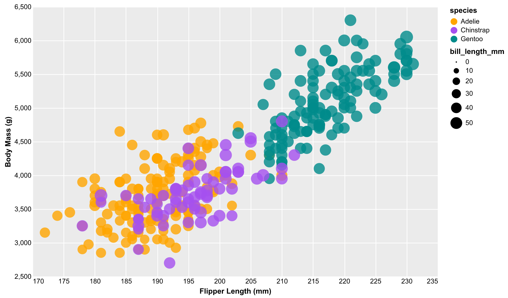
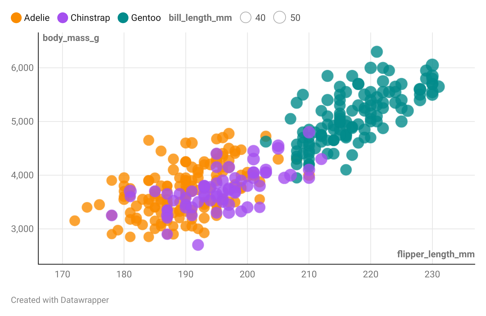

# 02-DataVis-5ways

Assignment 2 - Data Visualization, 5 Ways  
===

## d3

Notes:
- D3 requires more code to create the desired plot, but it is extremely customizable and flexible.
- With enough effort, you can replicate everything exactly as you want it. 

## Mosaic

I started with the `vanilla-example` from https://github.com/uwdata/mosaic. I also referenced the mosaic examples like https://idl.uw.edu/mosaic/examples/symbols.html.

Notes:
- Mosaic uses a SQL-like syntax to manipulate data, which is very convenient for those familiar with SQL.
- Mosaic's vgplot library mirrors Observable Plot, which makes it familiar, but I found it to be very challenging to customize.
    - Out of all the libraries I used, this was the most opinioned and least feature-rich. 
    - Specifically, there is no native way to add a scale legend. This is the only library where I couldn't do this at all.
        - There is an [open issue](https://github.com/observablehq/plot/issues/236) for this in Observable Plot, and thus Mosaic won't get this feature until Observable Plot does. 
    - I think a lot of this comes down to them basing their API on Observable Plot, so I had to constantly look at Observable's documentation to see how to do something. Then hope that it was implemented in Mosaic's vgplot.
- In terms of data flexibility, Mosaic is clearly very powerful since it uses DuckDB under the hood, so you can use SQL, parquet, csv, etc.

## Matplotlib / Seaborn

Notes:
- The colors are not exactly the same as the original due to differences in default color palettes between ggplot2 and Seaborn. I tried to match purple manually since it was the most different.
- The legend is clearly different in style. I placed it to the right side so it is similar to the original. 
- The legend uses greater granularity for the sizes.
- I had to add some custom code to get the point outlines to match their fill instead of being white.

### 3D Matplotlib

- I'll discuss this more in techncial achievements, but I used Matplotlib's 3D capabilities to create an interactive 3D scatter plot.

## R + ggplot2

Notes:
- Since the original graphic was created with ggplot2, the R + ggplot2 version is nearly identical to the original.

## Altair

Notes:
- The colors are not exactly the same as the original due to differences in default color palettes between ggplot2 and Altair. 
- The legend is different in style, but placed similarly to the seaborn version.
- It required more specific customization to mimic the gray grid theme of the original.
- Working with Altair was very nice since it is very customizable and has a clean API.

## Bonus: DataWrapper

Notes:
- It was very easy to create the scatter plot and do most of the customization.
- The only thing I couldn't do was add an outline to the points that matched their fill color. You could customize the outline color, but it was the same for all points.