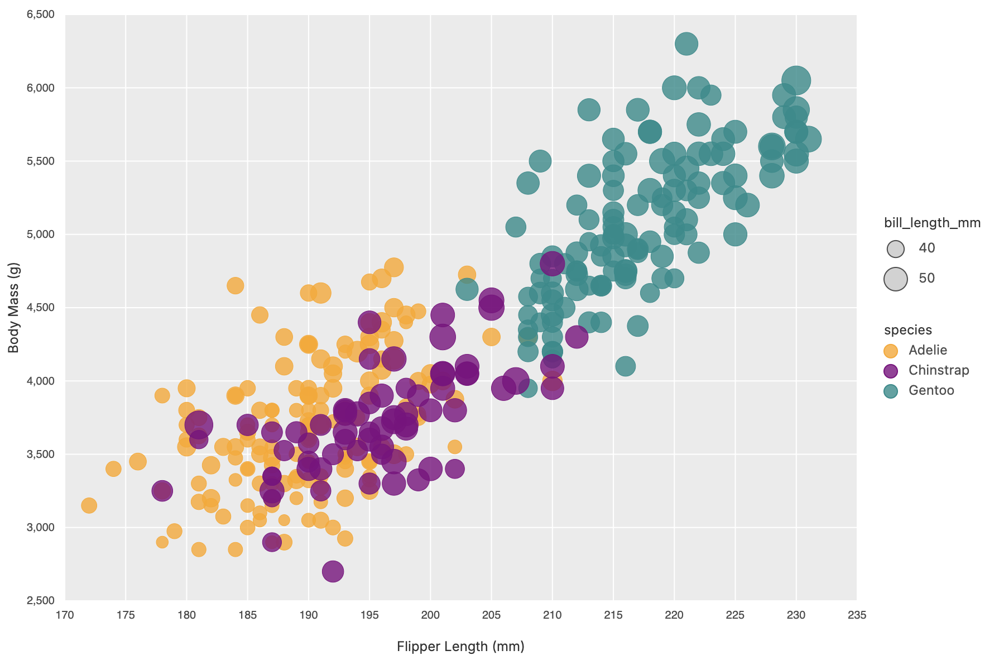
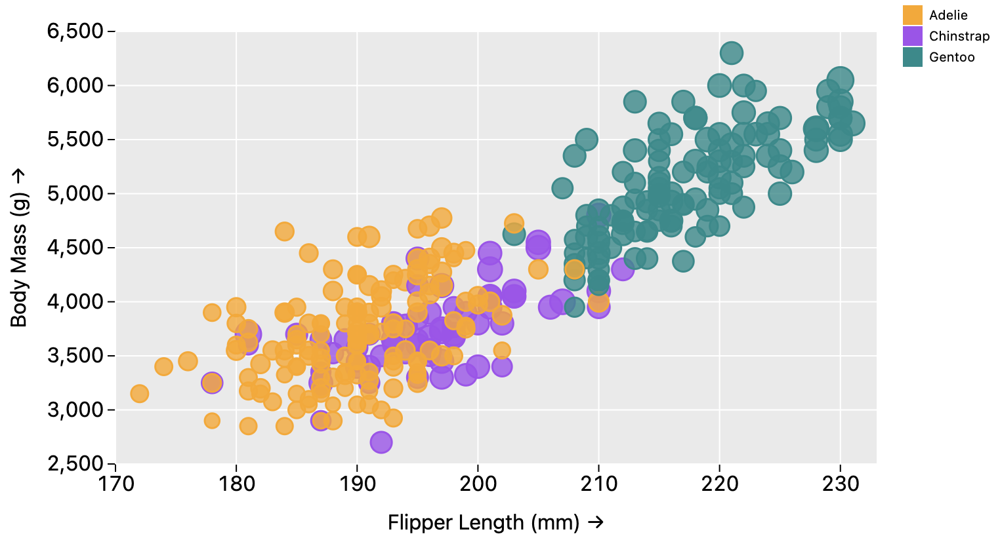
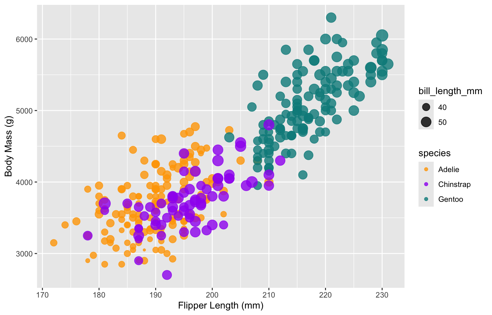

Assignment 2 - Data Visualization, 5 Ways  
===

Instructions for running the code can be found at the bottom. Technical and design achievements are also at the bottom. 

If anything stood out about a specific approach, I noted it in the respective section. Most details are in the Technical and Design Achievements section.

# d3



Notes:
- D3 requires more code to create the desired plot, but it is extremely customizable and flexible.
- With enough effort, you can replicate everything exactly as you want it. 

## Interactive Histograms


- When you hover the mouse over a point, it highlights it.
- When you click a point, it creates three histograms below, each showing the point in a distribution of its own species for each of the three chosen numeric metrics (flipper length, body mass, bill length).

# Mosaic

I started with the `vanilla-example` from https://github.com/uwdata/mosaic. I also referenced the mosaic examples like https://idl.uw.edu/mosaic/examples/symbols.html.



Notes:
- Mosaic uses a SQL-like syntax to manipulate data, which is very convenient for those familiar with SQL.
- Mosaic's vgplot library mirrors Observable Plot, which makes it familiar, but I found it to be very challenging to customize.
    - Out of all the libraries I used, this was the most opinioned and least feature-rich. 
    - Specifically, there is no native way to add a scale legend. This is the only library where I couldn't do this at all.
        - There is an [open issue](https://github.com/observablehq/plot/issues/236) for this in Observable Plot, and thus Mosaic won't get this feature until Observable Plot does. 
        - I DID scale the points by bill length, but there is no legend to indicate this.
    - I also couldn't figure out how to remove the arrows at the end of the axes.
    - Additionally, the render order of the different species was different from the other libraries. Perhaps I could have modified this with SQL.
    - I think a lot of this comes down to them basing their API on Observable Plot, so I had to constantly look at Observable's documentation to see how to do something. Then hope that it was implemented in Mosaic's vgplot.
- In terms of data flexibility, Mosaic is clearly very powerful since it uses DuckDB under the hood, so you can use SQL, parquet, csv, etc.

# Matplotlib / Seaborn


Notes:
- The colors are not exactly the same as the original due to differences in default color palettes between ggplot2 and Seaborn. I tried to match purple manually since it was the most different.
- The legend is clearly different in style. I placed it to the right side so it is similar to the original. 
- The legend uses greater granularity for the sizes.
- I had to add some custom code to get the point outlines to match their fill instead of being white.

## 3D Matplotlib Scatterplot


- I used Matplotlib's 3D capabilities to create an interactive 3D scatter plot.
- There is no size legend since bill length is one of the three axes. I also felt that it could be challenging for the user to perceive size differences in a 3D plot.

# R + ggplot2



Notes:
- Since the original graphic was created with ggplot2, the R + ggplot2 version is nearly identical to the original.

# Altair


Notes:
- The colors are not exactly the same as the original due to differences in default color palettes between ggplot2 and Altair. 
- The legend is different in style, but placed similarly to the seaborn version.
- It required more specific customization to mimic the gray grid theme of the original.
- Working with Altair was very nice since it is very customizable and has a clean API.
- For an unknown reason, I couldn't get the stroke to show up for the points, despite following the documentation.

# Bonus: DataWrapper


Notes:
- It was very easy to create the scatter plot and do most of the customization.
- The only thing I couldn't do was add an outline to the points that matched their fill color. You could customize the outline color, but it was the same for all points.

# Overall Technical Achievements

- Implemented the original scatter plot in 5 different programming languages/libraries (D3, Mosaic, Matplotlib/Seaborn, R + ggplot2, Altair) plus a bonus using DataWrapper.
    - Two of these (D3 and Mosaic) are JavaScript-based, two are Python-based (Matplotlib/Seaborn and Altair), and one is R-based (ggplot2).
    - D3 is a low-level JS library for SVG manipulation, while Mosaic is a higher-level plotting framework built on top of DuckDB for data manipulation and vgplot (Observable Plot) for data-driven visualization.
    - Matplotlib/Seaborn create Python-native plots, while Altair is a declarative plotting library that compiles to Vega-Lite, which is a web-first visualization grammar.
    - R + ggplot2 is a well-known R plotting library based on the Grammar of Graphics.
- Created interactive histograms in D3 that highlight the selected point's position in the distribution of its own species for three different numeric metrics.
- Created an interactive 3D scatter plot using Matplotlib's 3D capabilities, allowing users to rotate and explore the data in three dimensions.
- Used SQL-like data manipulation in Mosaic to efficiently filter and prepare the dataset for visualization.
- Used custom code in D3 and Matplotlib to closely mimic the original ggplot2 theme and legend.
- Extensively customized Mosaic and Altair's plots to mimic the original ggplot2 theme, despite their limitations.

# Overall Design Achievements

- Maintained visual consistency across all implementations by closely following the original ggplot2 design, including color schemes, point sizes, and legend placements.
    - This was sometimes impossible to match perfectly, but I tried my best. For instance, with Altair and Matplotlib, I had to move the legend to the right side to match the original. For Altair, I couldn't keep the legend order the same as the original.
    - For DataWrapper, the legend was at the top, and I couldn't really change that.
    - For all the library-based implementations, I ensured that the grid lines and background colors were as close to the original as possible (tried to mimic "theme_grey" from ggplot2).
    - I tried to make sure the border colors matched the fill colors for points, but this was not possible in DataWrapper.
    - I tried to match the point sizes as closely as possible, but some libraries had different scaling.
    - I tried to match plot dimensions, but some libraries scale the plots differently based on the container or window size.
    - I had no issue using the same opacity (0.8) for all points across all implementations.
- For the interactive histograms in D3, I designed them to match their color scheme with the selected point's species, using a more bold color for the highlighted bin.

# Instructions to Run the Code

**Python (Matplotlib/Seaborn and Altair):**

Both projects are managed with `uv`. If you have it installed, can you do `uv sync` in the respective directories to install dependencies. Then run `uv run <script>` to run the code.

If you have a global Python environment, you can just run the code directly assuming you have the dependencies installed.

**JS-Based (D3 and Mosaic):**

You need to have `node` and `npm` installed. Then, in each respective directory, run:

```
npm install
npm run dev
```

**R + ggplot2:**

R and RStudio

**DataWrapper:**

Just use the web interface at https://www.datawrapper.de/